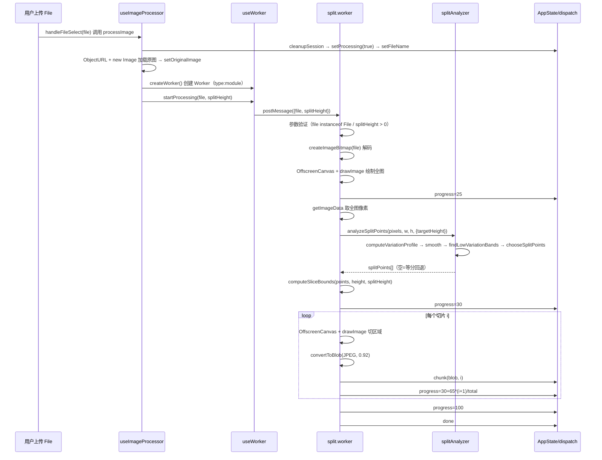

# 切割流水线模块（Split Pipeline）

用户通过路由系统导航到 `/upload` 页面并选择图片后，接下来的问题便是：这张长截图在浏览器里如何被拆成一段段可预览、可导出的切片？本模块正是这条从文件到切片的完整流水线。

---

## 1. 在项目中的角色

本模块是整个系统的计算心脏。去掉它，用户上传图片后只能看到原图——没有切片、没有内容感知分割、没有渐进式进度反馈，导出系统也无数据可消费。项目将失去全部核心价值。

## 2. 解决什么问题

长截图（如聊天记录、网页全文截取）高度可达数千像素，直接导出 PDF 会产生字号极小的页面。需要将原图按合理高度切为多段，每段对应 PDF 一页。但简单的固定高度等分会把文字截断在两页之间——内容感知切割要找到视觉上的「空白带」作为分割线，让每段首尾完整。同时，图片解码和像素遍历计算量大，必须在后台线程执行以免冻结 UI。

## 3. 设计思路

### 核心方案：四层分离架构

1. **useImageProcessor**——协调层：串联预处理、Worker 通信、结果入库，不碰像素计算。
2. **useWorker**——传输层：管理 Worker 生命周期与消息路由，纯胶水。
3. **split.worker**——I/O 层：decode / getImageData / drawImage / convertToBlob，调用分析器拿到切割点后执行切片，自身不含算法逻辑。
4. **splitAnalyzer**——算法层：纯 TS 函数组，输入像素数据输出切割点，零 DOM/canvas/Worker 依赖，可独立单测。

放弃的替代方案：
- 主线程 canvas 切片——阻塞 UI，大图卡顿不可接受。
- 将分析逻辑写在 Worker 内——无法单测，算法与 I/O 耦合。
- 第三方图片处理库（如 jimp）——引入后端依赖，违反纯前端零后端哲学。

核心设计模式：**管道模式（Pipeline）+ 策略回退（Fallback Strategy）**。流水线逐段推进，任何环节异常均安全回退到固定等分而非中断。

## 4. 核心数据结构

### WorkerMessage——主线程与 Worker 之间的消息契约（v1.1）

```typescript
// types/index.ts:44-50
interface WorkerMessage {
  type: 'progress' | 'chunk' | 'done' | 'error';
  progress?: number;   // 0-100，分段含义：0-25 解码 / 25-30 分析 / 30-95 切片 / 100 完成
  blob?: Blob;         // 单个切片的 JPEG 数据
  index?: number;      // 切片序号，从 0 起
  message?: string;    // 仅 error 类型携带
}
```

主线程→Worker 方向为 `{ file: File, splitHeight: number }`（`split.worker.js:1-2`），反向为四种消息类型。契约将渐进式进度与逐切片交付统一在同一信道，避免多端口复杂度。

### ImageSlice——切片结果数据

```typescript
// types/index.ts:3-9
interface ImageSlice {
  blob: Blob;      // Worker 产出的 JPEG blob
  url: string;     // Object URL，供  渲染
  index: number;   // 序号
  width: number;   // 切片像素宽
  height: number;  // 切片像素高
}
```

blob 与 url 并存的设计是必须的：url 供 React 渲染，blob 供导出系统消费 PDF/ZIP，二者各司其职。

### Band——空白带中间结构（splitAnalyzer 内部）

```typescript
// splitAnalyzer.ts:17-24
interface Band {
  top: number;     // 起始行（inclusive）
  bottom: number;  // 结束行（exclusive）
  center: number;  // 带中心行，切割点候选
}
```

## 5. 核心业务流程



### 自然语言解读

**文件入口**：`App.tsx:196-222` 的 `handleFileSelect` 是触发点，调用 `processImage(file)` 后等待切片到达再自动跳转（`App.tsx:121-135`），而非上传后立即跳——因为 Worker 尚未产出切片，跳到 `/split` 会被状态守卫踢回。

**预处理**：`useImageProcessor.ts:92-133` 中 `processImage` 先 `cleanupSession` 清旧状态、设置 `isProcessing`、创建原图 `HTMLImageElement` 存入 `originalImage`，再创建 Worker 并发送处理请求。注意 `L125` 的 200ms 等待是当前实现的妥协——Worker 创建到就绪存在时序间隙，用 setTimeout 补而非事件驱动（待改进点）。

**Worker 通信**：`useWorker.ts:30-104` 管理完整生命周期。`L42-43` 使用 `type: 'module'` 创建 Worker——这是必须的，因为 Worker 内通过 ESM `import` 引入 splitAnalyzer，经典 Worker 不支持顶层 import。`L47-78` 的 onmessage 按消息类型分发到四个回调（progress/chunk/done/error），形成清晰的消息路由。

**Worker 内处理**：`split.worker.js:75-216` 是核心流程。decode → 全图绘制 → 内容分析 → 按切割点切片 → 逐片 blob → 发送。`L87` 用 `createImageBitmap` 解码，`L94-100` 用 `OffscreenCanvas` 绘制全图一次。`L116-117` 调用 `analyzeSplitPoints` 拿到切割点。`L125-129` 关键：分析任何异常 → splitPoints 置空 → 等分回退，**绝不因分析失败中断或劣化**。

**切片生成**：`split.worker.js:140-190` 循环每个切片。`L154` 创建临时 OffscreenCanvas，`L158-168` 用 drawImage 从全图 canvas 复制指定区域，`L171` convertToBlob 为 JPEG。每产出一个切片立即 postMessage chunk（`L176-180`），主线程即刻收到，无需等全部完成——渐进式交付。

**结果入库**：`useImageProcessor.ts:30-65` 的 `handleChunk` 收到 blob 后：先 `addBlob` 存入状态，再 `createObjectURL` 生成渲染 URL，通过 `new Image()` 加载获取尺寸后 `addImageSlice` 完整切片对象入库。`handleDone`（`L68-72`）调用 `processingComplete`，标记处理结束。

## 6. 与其他模块的设计协同

### 依赖

- **useAppState（状态管理）**：useImageProcessor 的所有 actions（addBlob/addImageSlice/setProcessing/cleanupSession/processingComplete 等）来自 `useAppState` 的 dispatch，流水线不自治状态，只向状态层汇报。`useImageProcessor.ts:6-16`

### 被依赖

- **导出系统**：`exportToPDF` / `exportToZIP` 消费 `state.imageSlices`（`App.tsx:237-257`），每个切片的 blob 和 url 各有用途——blob 直接写入 PDF/ZIP，url 供预览渲染。
- **路由守卫**：`App.tsx:121-135` 监听 `imageSlices` 从 0→>0 触发自动跳转 `/split`；路由守卫（`validateNavigation`）检查 `imageSlices` 是否为空判定 `MISSING_SLICES`。`types/index.ts:109-114`

### 共享状态

- `imageSlices` 数组是流水线产出、状态层存储、导出系统消费的核心共享数据。
- `splitHeight` 由状态层持有，流水线读取并传给 Worker。`useImageProcessor.ts:128`
- `originalImage` 同理：流水线设置、预览组件消费。`App.tsx:307`

【待主 agent 验证】导出系统是否直接消费 blob 还是重新编码；路由守卫对 imageSlices 的判定是否与流水线渐进交付存在竞态。

## 7. 关键设计决策

### 7.1 Web Worker + OffscreenCanvas 而非主线程 canvas

长截图解码和像素遍历耗时可达数百毫秒至数秒，在主线程执行会冻结 UI——进度条不动、按钮不响应。Worker 线程独占计算，主线程只接收消息和更新 UI。`split.worker.js:94-100` 使用 `OffscreenCanvas` 而非 `HTMLCanvasElement`——后者仅在 DOM 线程可用，Worker 无法操作 DOM。`OffscreenCanvas` 是浏览器提供的 Worker 线程 canvas API，与 `createImageBitmap` 配合实现全链路后台计算。

### 7.2 splitAnalyzer 为纯 TS 函数而非 Worker 内嵌代码

`splitAnalyzer.ts:1-14` 明确声明「算法与 I/O 分离，本模块全部为纯函数，无 DOM/canvas/Worker 依赖，可独立单测」。Worker 仅做胶水（decode → getImageData → 调用分析器 → drawImage → blob），分析逻辑完全可脱离 Worker 单元测试。这种分离确保：算法迭代时无需启动 Worker；Worker 重构时算法不受影响；流水线的任何环节故障均可定位到具体层。

### 7.3 内容感知切割 vs 固定高度等分的设计权衡与安全回退

核心权衡：内容感知切割可能把文字截在两页之间切成更差的结果，但固定等分一定会在等分线处硬切。设计选择是**双轨并行 + 安全回退**：先尝试内容感知（`split.worker.js:116-129`），分析成功按切割点切，分析失败或无合格空白带则回退固定等分（`split.worker.js:228-250`）。回退保证「绝不切得比现状差」（`split.worker.js:1-11` 契约注释、`splitAnalyzer.ts:191` 安全原则）。

算法本身也有多层保护：`chooseSplitPoints` 中防碎页（间距 < mergeThreshold 则丢弃候选，`splitAnalyzer.ts:222-225`）、末页合并（剩余 < minPageHeight 则删除末点并入上页，`splitAnalyzer.ts:230-232`）、图片过短不切（`splitAnalyzer.ts:199-201`）。

### 7.4 Worker 消息契约 v1.1

四类消息（progress/chunk/done/error）的设计意图：progress 提供渐进反馈（用户看到进度条推进），chunk 逐片交付（切片到达即可预览，不必等全部完成），done 是终止信号（触发 processingComplete），error 是异常通道（任何环节故障走这里而非静默失败）。分段进度含义（0-25 解码 / 25-30 分析 / 30-95 切片 / 100 完成，`split.worker.js:1-4`）让 UI 可以展示阶段文案而非干巴巴的百分比。

## 8. Deep Research 洞察

- **替代方案代价**：若用 WASM 版 OpenCV 做边缘检测找分割线，精度更高但引入 2MB+ WASM 二进制，违反轻量纯前端哲学；当前水平投影方差方案计算量极低（列降采样 step=4 将计算量降至 1/4），单图毫秒级完成。
- **业界对比**：PDF 分页工具普遍用后端 ImageMagick 做切片；纯前端方案极少，且大多只做固定等分。本项目的内容感知+安全回退组合在纯前端场景中属少见。
- **重新设计**：若重来，可考虑事件驱动替代 setTimeout 200ms 等待（`useImageProcessor.ts:125`）——Worker 就绪后发 handshake 消息，主线程收到再发 file；可考虑 Transferable 传像素数据减少拷贝；可考虑分块 getImageData 处理超大图（`split.worker.js:112` 注释的优化项）。

## 9. 扩展点

- splitAnalyzer 的 `SplitOptions` 全部为 ratio 形式，天然适配不同尺寸图片，未来可加入 per-domain 参数集（聊天截图 / 网页全文 / 文档扫描各有最优参数）。
- Worker 消息契约可扩展 `type: 'stage'` 消息，携带阶段名（decode/analyze/slice），UI 展示更语义化的进度文案。
- `computeSliceBounds` 当前仅支持两种模式（切割点/等分），可扩展为「混合模式」：前半按切割点、后半等分。

## 10. 亮点与问题

**亮点**：
- 算法与 I/O 分离——splitAnalyzer 纯 TS 可单测，Worker 纯胶水，边界清晰（`splitAnalyzer.ts:1-14`、`split.worker.js:12`）。
- 安全回退——分析失败绝不中断或劣化，回退等分（`split.worker.js:125-129`、`splitAnalyzer.ts:191`）。
- 渐进式交付——切片逐个 postMessage chunk，主线程即刻可预览（`split.worker.js:176-180`）。
- 契约注释——Worker 文件头部完整记录消息协议和分段进度含义（`split.worker.js:1-11`）。

**问题**：
- `useImageProcessor.ts:125` 的 `setTimeout(200)` 是脆弱的时序补偿——Worker 创建到就绪应事件驱动而非硬等。
- `useWorker.ts:153-154` 返回 `workerRef.current` 和 `isWorkerReadyRef.current`——ref 在渲染时读取可能不是最新值，但这些字段当前未被外部使用，影响有限。
- `split.worker.js:116` 全图 `getImageData` 对超大图（>4000px）内存压力大，注释标注为未来优化项但未实施。

**涉及文件列表**：
- `src/App.tsx`
- `src/hooks/useImageProcessor.ts`
- `src/hooks/useWorker.ts`
- `src/workers/split.worker.js`
- `src/utils/splitAnalyzer.ts`
- `src/types/index.ts`

---

切割流水线将原始图片变为 `imageSlices` 数组后，接下来便是状态管理模块——useReducer 如何编排这些切片、选中集、处理状态，以及 CLEANUP_SESSION 如何清理 Object URL 防内存泄漏。

---

### 源码锚点清单（自检）

| 结论 | 锚点位置 | 锚点类型 |
|------|----------|----------|
| 流水线触发入口是 handleFileSelect → processImage | App.tsx:196 | 流程起点 |
| 上传后不立即跳转，等切片到达再跳 | App.tsx:121-135 | 时序策略 |
| processImage 先 cleanupSession 再 setProcessing | useImageProcessor.ts:97-101 | 状态编排 |
| 200ms setTimeout 补偿 Worker 创建时序 | useImageProcessor.ts:125 | 实现妥协 |
| Worker 创建 type:module 因 ESM import | useWorker.ts:42-43 | 技术约束 |
| onmessage 四类消息路由 | useWorker.ts:47-78 | 契约实现 |
| createImageBitmap 解码 + OffscreenCanvas 绘制 | split.worker.js:87-100 | I/O 层 |
| 分析失败 → splitPoints=[] → 等分回退 | split.worker.js:125-129 | 安全回退 |
| computeSliceBounds 双轨（切割点/等分） | split.worker.js:228-250 | 策略切换 |
| 逐片 postMessage chunk 渐进交付 | split.worker.js:176-180 | 交付策略 |
| splitAnalyzer 纯函数声明 | splitAnalyzer.ts:1-14 | 设计边界 |
| 防碎页/末页合并/过短不切 | splitAnalyzer.ts:199-232 | 安全保护 |
| WorkerMessage 契约定义 | types/index.ts:44-50 | 类型契约 |
| ImageSlice 数据结构 | types/index.ts:3-9 | 数据结构 |
| handleChunk: blob→URL→Image→尺寸→addImageSlice | useImageProcessor.ts:30-65 | 结果入库 |
| 导出系统消费 imageSlices | App.tsx:237-257 | 跨模块依赖 |
