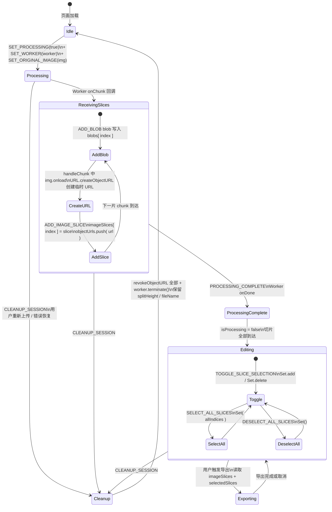

# 6. 状态管理 — useReducer 全局编排

**衔接**：前一个模块（切割流水线）的 Worker 产出 chunks 后，通过 `onChunk` 回调在主线程逐片抵达——此时需要一个统一的、可预测的状态容器来编排 blob 存储、Object URL 构造、切片索引排序和选中状态管理。这个容器就是 `useAppState`。

## 6.1 在项目中的角色

状态管理是本项目的「神经系统」——它连接切割流水线（上游）和导出系统（下游），通过单一 `useReducer` 实例统一持有 9 个关键状态字段。它是 App.tsx 中唯一被所有功能模块共享的变量来源 `src/App.tsx:29`。去掉它，切割结果（blobs、Object URL）、切片索引、选中状态将散落为 App.tsx 内的零散 `useState` 调用，导出系统无法从统一入口获取 `imageSlices` 和 `selectedSlices`，导航守卫也无从验证状态前置条件。

## 6.2 解决什么问题

业务场景决定状态复杂度：用户上传一张长截图 → Worker 切分成 N 个 Blob → 每片需要创建 Object URL 才能预览 → 用户勾选/取消勾选切片 → 导出系统读取选中的切片并生成 PDF/ZIP。这个流程要求的不是简单的开关状态，而是**资源生命周期管理**（createObjectURL/revokeObjectURL）、**异步到达的有序写入**、**不可变选中集合**和**跨页面状态保持**（/upload → /split → /export 的状态不因路由变化而丢失）。没有统一状态管理，每次页面切换都需要重新构建状态，Object URL 会泄漏，Worker 无法被正确终止。

## 6.3 设计思路

### 为什么是 useReducer

项目选了 `useReducer` 而非 Redux、Zustand 或全局 Context，原因有三：

1. **规模刚好**：AppState 只有 9 个字段 `src/types/index.ts:11-28`，13 种 action `src/types/index.ts:30-42`。Redux 的 store/middleware/reducer 三层架构和 ImmutableJS 依赖对这个规模而言是过度设计。
2. **零额外依赖**：项目哲学是「自造而非引第三方」`CLAUDE.md:9`。`useReducer` 是 React 内置 API，不引入额外包体积。
3. **局部化而非全局化**：只有 App.tsx 需要消费此状态。用 Context 分发给深层子组件会导致不必要的重新渲染（状态变更时所有 consumers 都重新渲染）。直接把 `state` 和 `actions` 通过 props 传给子组件更精确。

被放弃的替代方案：

| 方案 | 放弃原因 |
|------|---------|
| Redux | 对于 9 字段/13 action 是过度设计，引入额外依赖 |
| Zustand | 第三方依赖，与「自造」哲学冲突 |
| 全局 Context | 子组件已在 App.tsx 内通过 props 接收状态，无需跨层级穿透 |
| 多个 useState | 无法表达「资源清理时必须同时 revokeURL + terminate worker」的原子操作语义 |

### 核心设计模式

- **Reducer 模式**：纯函数 `(state, action) -> state`，所有状态变更可追踪、可复现。
- **Action Creator + dispatch 封装**：每个 action 被封装为 `useCallback` 包裹的函数，组件只调用语义化 API 而不直接 `dispatch(type, payload)` `src/hooks/useAppState.ts:152-198`。
- **资源 RAII 式管理**：通过单一 `CLEANUP_SESSION` action 统一释放 Object URL 和 Worker，模拟 RAII 的资源获取即初始化语义。

## 6.4 核心数据结构

```typescript
// src/types/index.ts:11-28
interface AppState {
  // Worker 相关
  worker: Worker | null;         // Web Worker 实例引用，CLEANUP_SESSION 时 terminate
  blobs: Blob[];                 // 按 index 存储的原始 Blob 数组
  objectUrls: string[];          // 所有已创建的 Object URL，CLEANUP_SESSION 时批量 revoke

  // 图片处理状态
  originalImage: HTMLImageElement | null;  // 用户上传的原始长截图
  imageSlices: ImageSlice[];    // 每片切片信息（blob+url+index+width+height）
  selectedSlices: Set<number>;  // 用户当前选中的切片索引集合（Set 保证唯一性）

  // 元数据
  isProcessing: boolean;        // Worker 是否正在处理
  splitHeight: number;          // 分割高度（持久化到 localStorage）
  fileName: string;             // 输出文件名（持久化到 localStorage）
}

// src/types/index.ts:3-9
interface ImageSlice {
  blob: Blob;      // 切片原始二进制数据
  url: string;     // blob 的 Object URL（用于 img 标签 src）
  index: number;   // 切片在原图中的序号（0-based）
  width: number;   // 切片像素宽度
  height: number;  // 切片像素高度
}

// src/types/index.ts:30-42 — 13 种 action 的判别联合
type AppAction =
  | { type: 'SET_WORKER'; payload: Worker | null }
  | { type: 'ADD_BLOB'; payload: { blob: Blob; index: number } }
  | { type: 'SET_ORIGINAL_IMAGE'; payload: HTMLImageElement | null }
  | { type: 'ADD_IMAGE_SLICE'; payload: ImageSlice }
  | { type: 'TOGGLE_SLICE_SELECTION'; payload: number }
  | { type: 'SELECT_ALL_SLICES' }
  | { type: 'DESELECT_ALL_SLICES' }
  | { type: 'SET_PROCESSING'; payload: boolean }
  | { type: 'SET_SPLIT_HEIGHT'; payload: number }
  | { type: 'SET_FILE_NAME'; payload: string }
  | { type: 'CLEANUP_SESSION' }
  | { type: 'PROCESSING_COMPLETE' };
```

### 持久化子集

并非整个 AppState 都持久化。只有 `splitHeight` 和 `fileName` 通过 500ms 防抖写入 localStorage `src/hooks/useAppState.ts:126-133` + `src/utils/persistence.ts:67-79`。blobs、objectUrls、imageSlices 等大体积运行时数据不持久化，因为 Blob 和 Object URL 无法序列化。

## 6.5 核心业务流程

### 状态图



### 源码级别的流程解读

**初始状态创建** `src/hooks/useAppState.ts:14-28`：`createInitialState` 从 localStorage 恢复 `splitHeight` 和 `fileName`，其余字段归零——`worker: null`、`blobs: []`、`objectUrls: []`、`originalImage: null`、`imageSlices: []`、`selectedSlices: new Set()`、`isProcessing: false`。

**切割阶段**：`useImageProcessor.processImage` 首先调用 `cleanupSession()` 清理旧会话 `src/hooks/useImageProcessor.ts:97`，然后依次 dispatch `SET_PROCESSING(true)`、`SET_WORKER`（由 useWorker 内部管理）和 `SET_ORIGINAL_IMAGE`。Worker 产出 chunk 后，`handleChunk` 回调中 `URL.createObjectURL` 创建临时 URL `src/hooks/useImageProcessor.ts:37`，通过 `new Image().onload` 获取尺寸后 dispatch `ADD_IMAGE_SLICE` `src/hooks/useImageProcessor.ts:58`。

**`ADD_IMAGE_SLICE` 的乱序修复** `src/hooks/useAppState.ts:47-60`：使用数组索引赋值（`newImageSlices[action.payload.index] = action.payload`）而非 `push`。这解决了 img.onload 回调可能不按 chunk 到达顺序触发的乱序问题——只要每个切片携带了正确的 index，最终数组必然是按 index 有序的。

> **稀疏数组副作用**：按 index 赋值会产生稀疏数组（已到达的 index 有值，未到达的为 empty）。`SELECT_ALL_SLICES` 通过 `state.imageSlices.map(slice => slice.index)` 获取全索引，此时 empty 元素会导致 `slice` 为 undefined，`slice.index` 抛出 TypeError。不过在当前 Workers 顺序产出 chunk 的场景下，稀疏通常能在 `PROCESSING_COMPLETE` 触发前被填满。

**选中状态**：`selectedSlices` 使用 `Set<number>` 而非数组——确保每次 toggle 都是 O(1) 的 add/delete，且不会重复。`TOGGLE_SLICE_SELECTION` 每次创建新 Set 以保证不可变性 `src/hooks/useAppState.ts:62-70`。

**资源清理** `src/hooks/useAppState.ts:89-112`：`CLEANUP_SESSION` 分三步：
1. 遍历 `state.objectUrls` 逐一 `URL.revokeObjectURL(url)`，异常时仅 warn 不中断。
2. 调用 `state.worker.terminate()` 终止 Worker 线程，异常时仅 warn。
3. 返回 `{ ...initialState, splitHeight, fileName }`——重置所有运行时状态但保留用户偏好。

**导出阶段数据流向** `src/App.tsx:237-244`：`handleExport` 读取 `state.imageSlices`（全部切片）和 `state.selectedSlices`（选中索引集合），传入 `exportToPDF` 或 `exportToZIP`。导出函数内部按 `selectedIndices.has(slice.index)` 过滤并按 index 排序 `src/utils/pdfExporter.ts:59-61`。

## 6.6 与其他模块的设计协同

### 上游依赖（切割流水线 → 状态管理）

切割流水线通过 `useImageProcessor` 接收 `actions` 对象 `src/hooks/useImageProcessor.ts:7-16`，在 chunk 到达时依次调用：
- `actions.addBlob(blob, index)` → dispatch `ADD_BLOB`
- `actions.addImageSlice(slice)` → dispatch `ADD_IMAGE_SLICE`
- `actions.processingComplete()` → dispatch `PROCESSING_COMPLETE`

Worker 实例本身也写入状态：`useWorker` 创建 Worker 后通过 `actions.setWorker` 注册到 AppState 【待主 agent 验证：useWorker 如何将 worker 实例传给 useAppState——当前 useWorker 内部使用 `workerRef` 局部持有，但 useImageProcessor 中未见 dispatch SET_WORKER 的直接调用，可能通过 useWorker 外部调用 setWorker】。

### 下游消费（状态管理 → 导出系统）

导出系统是纯函数式消费方：`exportToPDF(imageSlices, selectedIndices, fileName, onProgress)` `src/utils/pdfExporter.ts:208-216` 和 `exportToZIP(imageSlices, selectedIndices, fileName, onProgress)` `src/utils/zipExporter.ts:217-225`。它们不修改状态，只读取当前的 `imageSlices` 和 `selectedSlices` 引用，按 index 过滤排序后处理。

### 路由系统交互

导航守卫通过 `validateNavigation(currentPath, state)` 读取 AppState `src/App.tsx:143`，根据 `state.originalImage` 和 `state.imageSlices.length` 判断当前页面是否有渲染所需的前提数据。如果验证失败，调用 `actions.cleanupSession()` 清理异常状态并重定向 `src/App.tsx:164-170`。

### 上传完成自动跳转

App.tsx 通过 `useEffect` 监听 `state.imageSlices.length` 从 0 变化为 >0，触发 `/split` 路由跳转 `src/App.tsx:124-135`。这是状态变更驱动路由切换的典型模式——确保切片到达后再跳转，避免导航守卫因 `imageSlices` 为空而踢回上传页。

## 6.7 关键设计决策

### 1. useReducer vs 第三方状态库

项目核心哲学是零第三方运行时依赖（仅 jsPDF 和 JSZip 用于导出，这两个是纯工具函数不涉状态），状态管理选择 `useReducer` 是必然。9 个字段、13 种 action 的规模完全在 `useReducer` 的舒适区——Reducer 函数仅 86 行 `src/hooks/useAppState.ts:33-120`，action creator 仅 46 行 `src/hooks/useAppState.ts:152-198`。引入 Zustand（~2KB gzip）或 Redux（~5KB+）会在包体积上增加不必要的负载，且引入的新概念（Zustand 的 immer middleware、Redux 的 action type 常量）与项目「简单直接」的风格冲突。

### 2. 资源生命周期管理

这是模块最精妙的设计之一。`CLEANUP_SESSION` 将三个资源释放动作捆绑为单一 action：

- `URL.revokeObjectURL` 释放所有 Object URL（防止内存泄漏）
- `worker.terminate()` 终止 Worker 线程（防止线程泄漏）
- 重置运行时状态为初始值

这种捆绑的价值在于：调用方（`processImage` 新会话开始时 `src/hooks/useImageProcessor.ts:97`、导航错误恢复时 `src/App.tsx:166`）无需逐一了解需要清理哪些资源——只需 dispatch 一个 `CLEANUP_SESSION`，reducer 内部保证了清理的完备性和异常安全（每个释放操作都有 try-catch 保护，一个失败不影响其他释放）`src/hooks/useAppState.ts:92-106`。

这个设计也暴露了一个潜在问题：如果 AppState 未来新增需要清理的资源（如 IndexedDB 连接、新的 Worker 实例），必须在 reducer 的 `CLEANUP_SESSION` case 中添加对应的清理逻辑——这是一种隐式契约，容易被遗忘。

### 3. imageSlices 按 index 写入的乱序问题

CLAUDE.md 标注「当前按异步到达顺序追加，潜在乱序」`CLAUDE.md:114`，但源码中 `ADD_IMAGE_SLICE` 已使用 `newImageSlices[action.payload.index] = action.payload` 方式写入 `src/hooks/useAppState.ts:51`，代码注释明确标注「修复 img.onload 回调导致的切片乱序（spec §5）」`src/hooks/useAppState.ts:49`。

推测 CLAUDE.md 的注释写于修复之前，当前代码已实现乱序修复。但稀疏数组的副作用仍存：如果某些 index 永远不到达（Worker 异常中断只产出部分切片），则 `SELECT_ALL_SLICES` 中的 `map(slice => slice.index)` 会在 empty 元素上抛出异常。这是一个未处理的边界情况。

## 6.8 Deep Research 洞察

### 替代方案代价

**Redux Toolkit**：引入 `@reduxjs/toolkit`（~12KB gzip）+ `react-redux`（~5KB gzip），需要 store 配置、slice 定义、Provider 包裹。对于本项目的状态规模，这是用大炮打蚊子。

**Zustand**：API 最接近本项目的 useReducer 模式（`create` 函数定义 store），且天然支持 selector 避免不必要的重渲染。但引入第三方依赖与项目哲学冲突，且对于 App.tsx 单组件消费的简单场景，props 传递已足够。

**React Context + useReducer**：`AppState` 通过 Context Provider 向下传递，子组件通过 `useContext` 获取。但本项目中子组件（FileUploader、ImagePreview、ExportControls）已通过 App.tsx 直接接收到所需 props——Context 只能增加无谓的层级抽象，不带来实际收益。

### 业界对比

大多数 React 项目在经过一段时间演进后会在 useState 散落 → useReducer 集中 → Context 分发 → 第三方库统一这条路径上逐级上升。本项目在第一步就直接停在 useReducer，且因为「无后端 + 单页面编排」的特殊架构，这个停留点恰好是甜区——既没有欠工程化（用 useState 管理资源生命周期是灾难），也没有过工程化（引入 Redux 只会增加 boilerplate）。

### 如果重新设计

1. **Sparse Array 处理**：为 `imageSlices` 增加 `compact` 工具函数，或改为 Map<number, ImageSlice> 避免稀疏数组的 empty 陷阱。
2. **CLEANUP_SESSION 的显式契约**：将资源清理抽象为注册表模式（如 `registerCleanup`），新增资源时自动纳入清理流程，避免隐式契约。
3. **Export 状态分离**：导出进度（`isExporting`）当前在 App.tsx 用独立的 `useState` 管理 `src/App.tsx:40`。如果导出流程变得更复杂（如支持多格式同时导出），可将其纳入 AppState 统一管理。

## 6.9 扩展点

- **导出进度纳入 AppState**：当前 `isExporting` 是 App.tsx 内局部 state，如果导出系统需要跨组件进度展示，可新增 `exportProgress` 字段和 `UPDATE_EXPORT_PROGRESS` action。
- **imageSlices 的 Map 替代**：如果未来需要支持「按 index 删除单张切片」，Map 结构比稀疏数组更自然。
- **Undo/Redo**：Reducer 模式天然支持——在当前架构上加一个 `historyStack` 和 `UNDO`/`REDO` action 即可，无需改动现有逻辑。

## 6.10 亮点与问题

### 亮点

| 亮点 | 说明 |
|------|------|
| 资源 RAII 式管理 | `CLEANUP_SESSION` 捆绑 Object URL 释放 + Worker 终止，单一入口保证完备性 |
| 按 index 写入防乱序 | 用数组索引赋值而非 push，解决了 img.onload 异步回调的乱序问题 |
| Set 管理选中状态 | O(1) 的 toggle 操作 + 不可变性保证（每次创建新 Set） |
| Action Creator 封装 | 组件不直接接触 `dispatch`，语义化 API 提升可读性和可测试性 |
| 最小持久化 | 仅持久化 `splitHeight` 和 `fileName`，Blob/URL 等不可序列化数据不写盘 |
| 异常安全 | 每个资源释放操作都有 try-catch 保护，一个失败不影响其他 |

### 问题

| 问题 | 严重程度 | 说明 |
|------|---------|------|
| 稀疏数组风险 | 中 | `ADD_IMAGE_SLICE` 的索引赋值产生稀疏数组，`SELECT_ALL_SLICES` 在空元素上访问 `.index` 会抛出异常 |
| CLEANUP_SESSION 隐式契约 | 低 | 新增需清理的资源时必须在 reducer 中手动添加清理逻辑，容易被遗忘 |
| worker 持有双份引用 | 低 | Worker 实例在 `useWorker` 的 ref 和 `AppState.worker` 中都有引用，可能造成不一致 【待主 agent 验证】 |
| 调试日志残留 | 低 | `ADD_IMAGE_SLICE` 中保留了 4 行 `console.log` `src/hooks/useAppState.ts:48-58`，生产环境未剥离 |

### 涉及文件

| 文件 | 行数 | 角色 |
|------|------|------|
| `src/hooks/useAppState.ts` | 237 | 核心：state/reducer/action creators |
| `src/types/index.ts` | 132 | 类型定义 |
| `src/App.tsx` | 745 | 消费状态、导航守卫、导出入口 |
| `src/hooks/useImageProcessor.ts` | 141 | 调用 actions 写入切割结果 |
| `src/utils/persistence.ts` | 81 | localStorage 持久化辅助 |
| `src/utils/pdfExporter.ts` | 217 | 消费 imageSlices + selectedSlices |
| `src/utils/zipExporter.ts` | 226 | 消费 imageSlices + selectedSlices |

**铺垫**：下一个模块（导出系统）将详细分析 `imageSlices` 和 `selectedSlices` 如何通过 `exportToPDF` / `exportToZIP` 被过滤、排序、组装为最终 PDF 或 ZIP 文件。

---

## 源码锚点清单

| 结论 | 锚点位置 | 锚点类型 |
|------|---------|---------|
| AppState 有 9 个字段 | `src/types/index.ts:11-28` | 类型定义 |
| AppAction 是 13 种判别联合 | `src/types/index.ts:30-42` | 类型定义 |
| ImageSlice 含 blob/url/index/width/height | `src/types/index.ts:3-9` | 类型定义 |
| 仅 splitHeight 和 fileName 持久化 | `src/hooks/useAppState.ts:25-26` | 初始状态读取 |
| 500ms 防抖持久化 | `src/hooks/useAppState.ts:11,126-133` | 逻辑 |
| useReducer 而非 Redux/Zustand | `src/hooks/useAppState.ts:123` | 架构决策 |
| ADD_IMAGE_SLICE 按 index 写入（非 push） | `src/hooks/useAppState.ts:51` | 核心逻辑 |
| SELECT_ALL_SLICES 潜在稀疏数组空指针 | `src/hooks/useAppState.ts:73` | 潜在 bug |
| CLEANUP_SESSION 统一 revoke + terminate | `src/hooks/useAppState.ts:89-112` | 核心逻辑 |
| handleChunk 先 URL.createObjectURL 再 img.onload | `src/hooks/useImageProcessor.ts:37-63` | 上游调用链 |
| exportToPDF 按 selectedIndices 过滤排序 | `src/utils/pdfExporter.ts:59-61` | 下游消费 |
| exportToZIP 按 selectedIndices 过滤排序 | `src/utils/zipExporter.ts:51-53` | 下游消费 |
| 导航守卫读 state 验证前置条件 | `src/App.tsx:143` | 协同交互 |
| 切片到达后自动跳转 /split | `src/App.tsx:124-135` | 状态驱动路由 |
| CLAUDE.md 标注乱序问题（与当前代码矛盾） | `CLAUDE.md:114` | 文档/代码不一致 |
| 项目零第三方运行时状态库 | `CLAUDE.md:9` | 架构哲学 |
